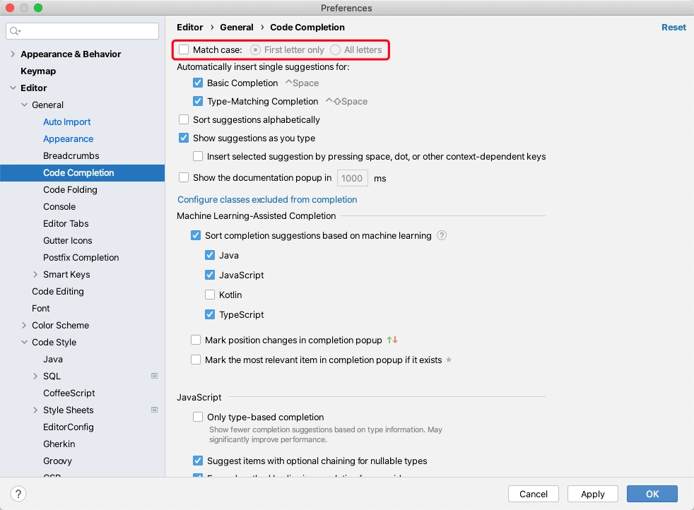
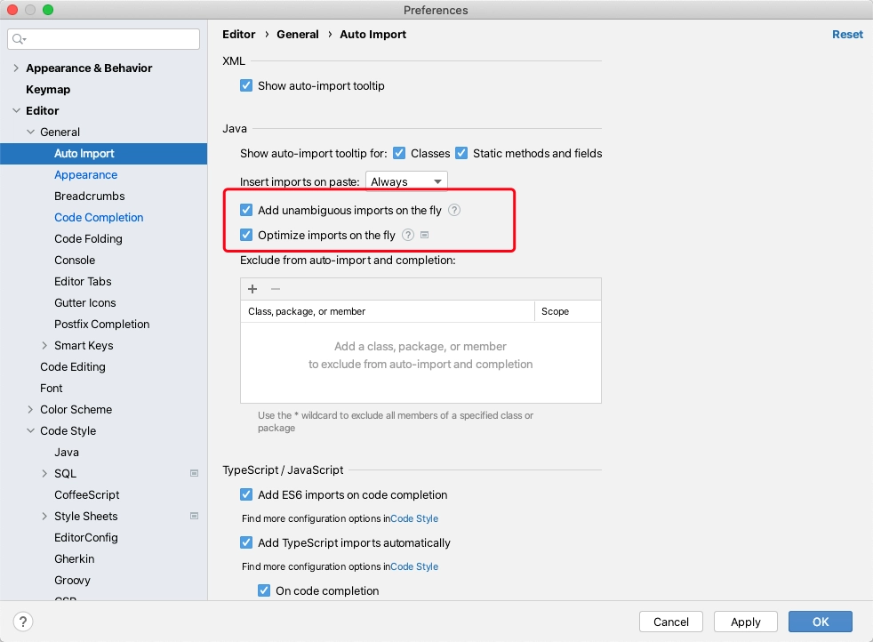
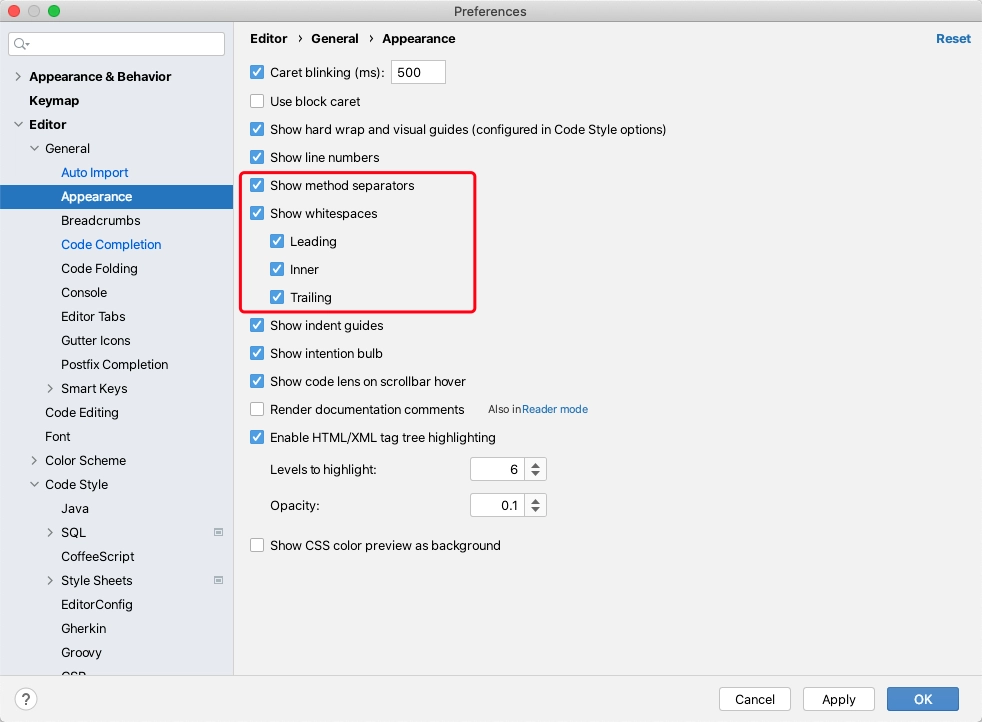
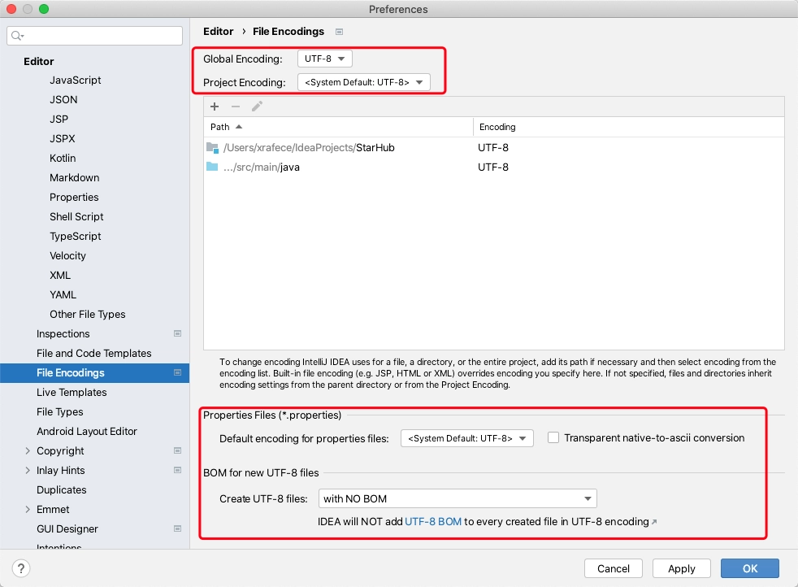
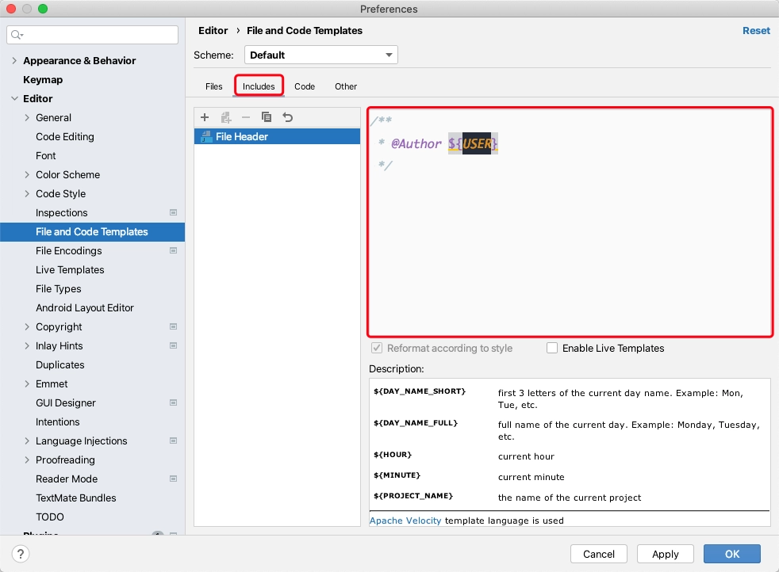
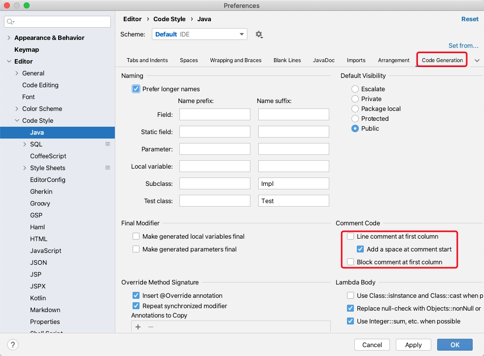
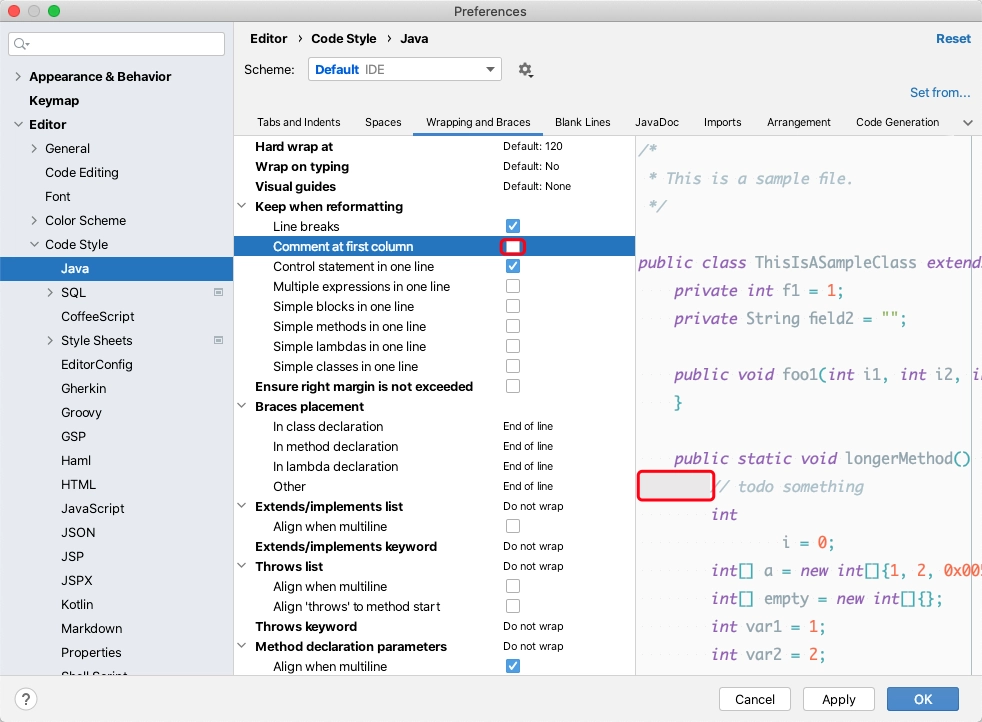
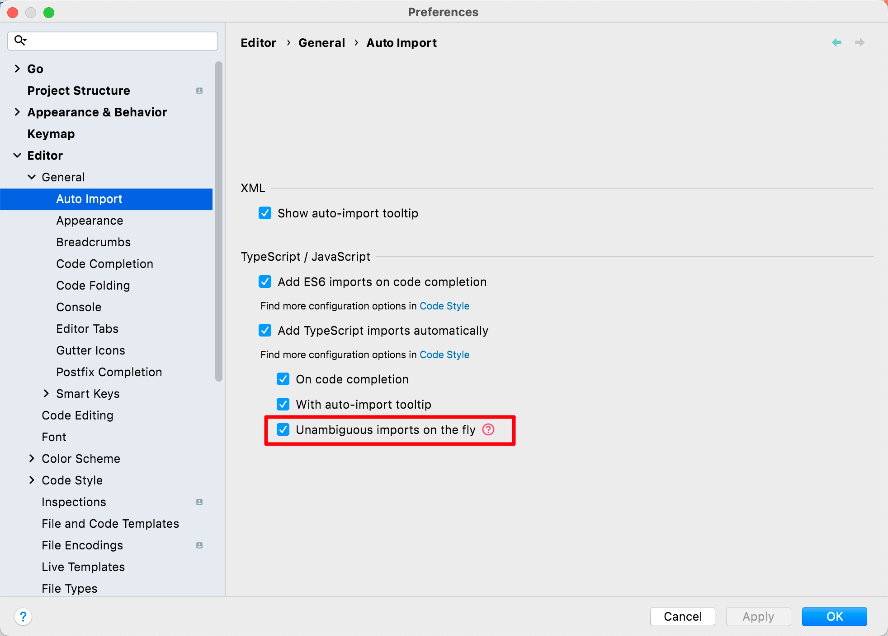
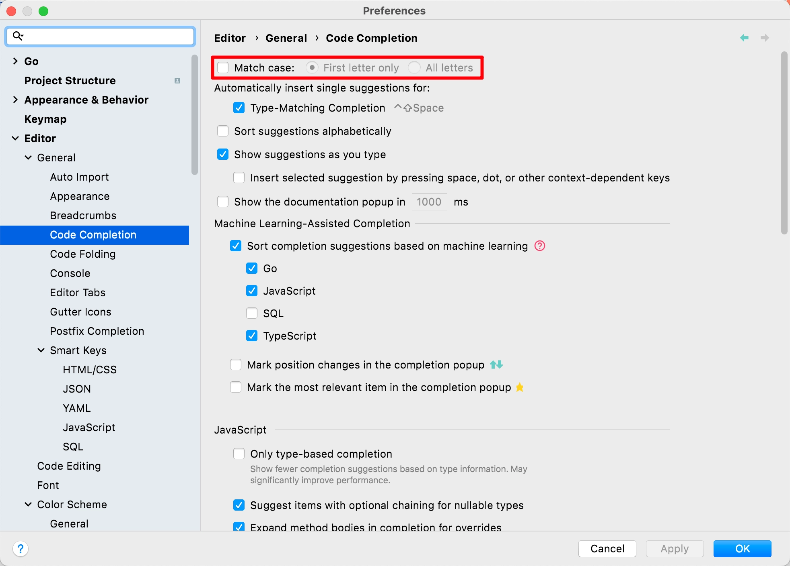
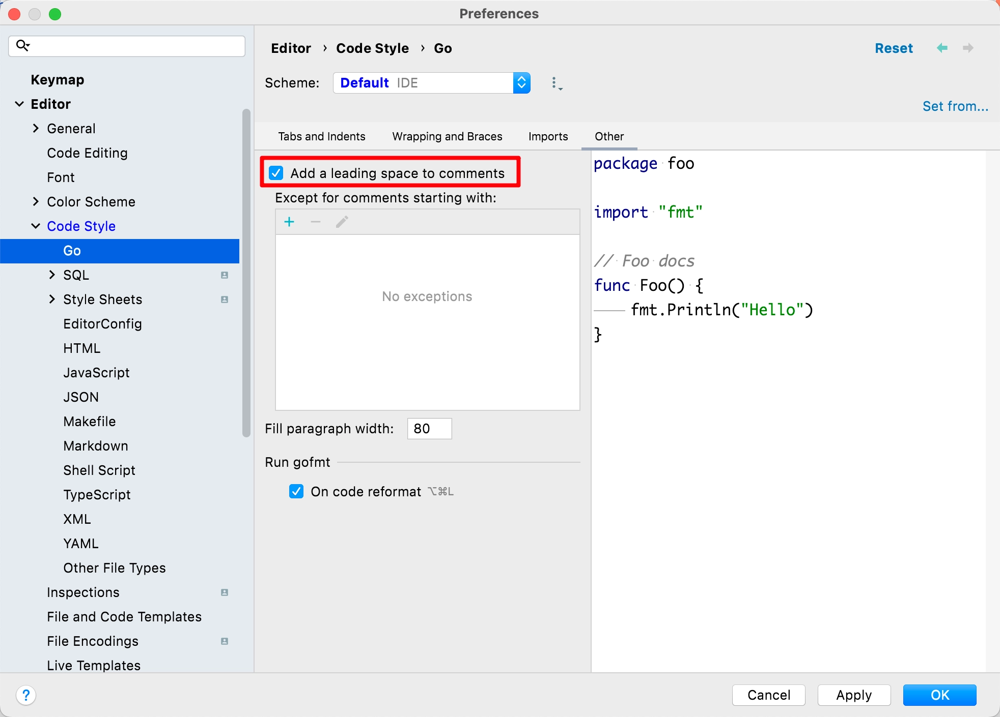

Mac OS  和 Windows 环境下对 JetBrains IDE 进行初始选项偏好设置

# IntelliJ IDEA

## Match Case 不区分大小写



## Auto Import 自动导包



## Show Method Separators and WhiteSpaces 显示方法分界线和空格



## File Encodings 文件编码



## File and Code Templates 文件和代码模板



```
/**
 * @Author ${USER}
 */
```

## Code and Comment Indent Setting 代码和注释缩进设置





## Plugins 插件

1. `Material Theme UI Lite`

2. `Presentation Assistant`

3. `Alibaba Code Guide`

# GoLand

## Auto Import 自动导包



## Match Case 不区分大小写



## Show Method Separators and WhiteSpaces 显示方法分界线和空格


## Comment Setting 注释前添加空格



## Plugins 插件

1. `Presentation Assistant`
