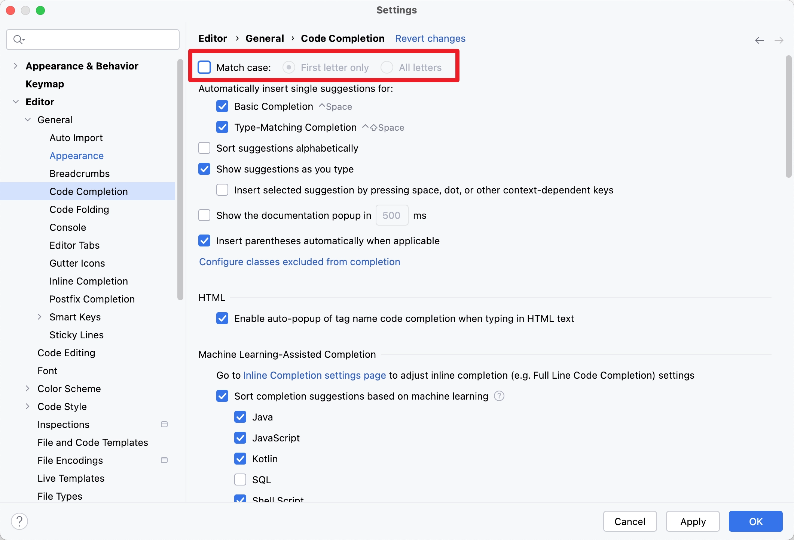

Mac OS 和 Windows 环境下对 JetBrains IDE 进行初始选项偏好设置

# IntelliJ IDEA

## Appearance 外观


可以设置 light with light header 主题，让这个界面都保持亮色

## Presentation Assistant  演示助理（快捷键显示）


## Auto Import 自动导包


中文界面


## Show Method Separators and WhiteSpaces 显示方法分界线和空格


中文界面


## Match Case 不区分大小写



中文界面


## File Encodings 文件编码


中文界面


## File and Code Templates 文件和代码模板


中文界面


```
/**
 * @Author ${USER}
 */
```

## Code and Comment Indent Setting 代码和注释缩进设置


中文界面


## Plugins 插件

1. `Material Theme UI Lite`

2. `IdeaVim`

3. `Astro`

# GoLand

## Auto Import 自动导包


## Match Case 不区分大小写


## Show Method Separators and WhiteSpaces 显示方法分界线和空格


## Comment Setting 注释前添加空格


## Plugins 插件

1. `Presentation Assistant`
